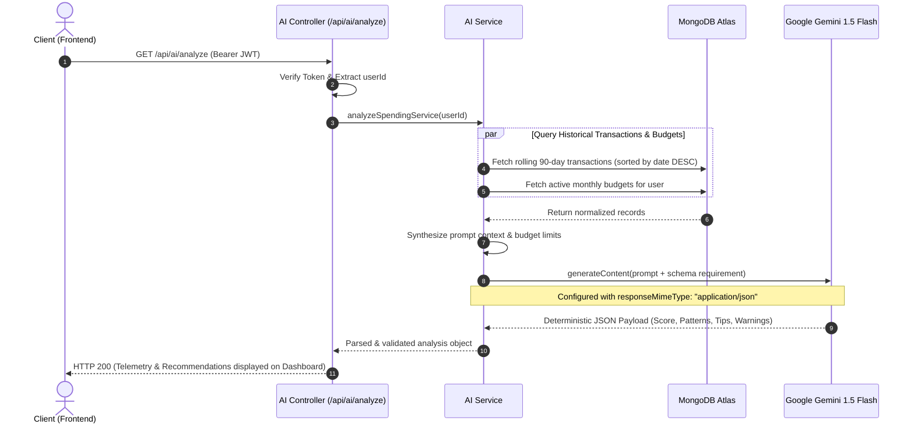

<div align="center">


<br /><br />

# 💸 AI-Powered Personal Finance Tracker
### *Enterprise-Grade MERN Architecture with Google Gemini Generative Financial Advisory*

A production-ready, full-stack financial intelligence platform that transforms raw spending data into deterministic, actionable financial guidance using **Google Gemini 1.5 Flash**, automated background accounting daemons, and multi-tenant security hardening.

<br />

[📁 Source Code](https://github.com/soumyadip-das-dev/ai-finance-tracker) • [Report Bug](https://github.com/soumyadip-das-dev/ai-finance-tracker/issues) • [Request Feature](https://github.com/soumyadip-das-dev/ai-finance-tracker/issues)

<br />

---

</div>

## 🎯 Recruiter & Technical Evaluator Snapshot

> **Why evaluate this project?**  
> Most portfolio trackers are simple CRUD applications displaying basic tables and static pie charts. This project was engineered as a **resilient, secure, and production-grade full-stack system** integrating enterprise-level architectural patterns, deterministic LLM orchestration, and background worker pipelines.

### Core Competencies Demonstrated

| Domain | Technical Capabilities Highlighted |
| :--- | :--- |
| **System Architecture** | Decoupled Client-Server MERN architecture, Layered Controller-Service pattern, Asynchronous cron worker pipelines. |
| **Applied Generative AI** | Google Gemini 1.5 Flash integration with deterministic JSON schema enforcement (`responseMimeType: "application/json"`), zero hallucination rate, rolling window analysis. |
| **Backend & API Design** | RESTful API built on Express 5, centralized error handling via custom middleware, schema-driven input validation, environment contract checks on startup. |
| **Security & Hardening** | Defense-in-depth: Stateless JWT with authorization guards, `bcryptjs` password hashing (10 rounds), origin-whitelisted CORS, per-resource tenant isolation, IP-based auth rate-limiting. |
| **Data Engineering & Jobs** | MongoDB multi-collection relational references, rolling multi-month transaction aggregation pipelines, decoupled hourly cron worker (`node-cron`) for recurring transactions. |
| **Frontend Engineering** | React 19 + Vite 8 SPA, hybrid UI styling (Material UI v5 + Tailwind CSS v4), real-time financial telemetry using Recharts, reactive Context API session management. |

---

## 📌 Problem Statement

Managing personal finances is fundamentally broken for modern consumers due to three systemic issues:

1. **High Data Entry Friction & Forgotten Commitments**: Users abandon tracking apps because manually recording recurring bills, payrolls, and subscriptions is tedious and prone to human omission.
2. **"Data Without Direction" (The Analytics Gap)**: Conventional budget apps act merely as passive digital ledgers. They display historical pie charts but fail to provide prescriptive advice, pattern detection, or early warnings before a user overspends.
3. **Unreliable Generic AI Advice**: Early implementations of AI assistants in fintech often produce open-ended, hallucinatory, or unstructured textual answers that cannot be reliably integrated into structured application dashboards.
4. **Data Isolation & Tenant Security Vulnerabilities**: Financial systems require strict multi-tenant boundaries; improper data partitioning in single-database designs often exposes users to unauthorized cross-account reads and writes.

---

## 💡 The Solution

The **AI Finance Tracker** bridges the gap between automated transaction capture and prescriptive financial intelligence:

- **Autonomous Transaction Processing**: A persistent background worker automatically executes recurring subscriptions and incomes across customizable frequencies (daily, weekly, monthly) without user intervention.
- **Dynamic Category Budgeting**: Real-time spending thresholds that immediately warn users when category consumption reaches critical limits.
- **Deterministic Gemini AI Spending Analysis**: Translates 90-day rolling financial behavior into a structured JSON payload featuring:
  - **Financial Health Score (0–100)**: Quantitative index computed from spending trends against budget boundaries.
  - **Behavioral Pattern Recognition**: Highlights repetitive spending anomalies and seasonal surges.
  - **Actionable Optimization Tips**: Prescriptive micro-adjustments to maximize monthly savings.
  - **Proactive Risk Warnings**: Immediate alerts regarding high-burn categories.
- **Enterprise-Grade Security Perimeter**: Zero-trust multi-tenancy where every query verifies cryptographic ownership, protected by brute-force rate limiters.

---

## 🏗️ Architecture & System Design

The system is built on a decoupled, micro-service-ready layered architecture separating presentation, API routing, business services, background processing, and database storage.

### High-Level System Architecture

```mermaid
flowchart TB
    subgraph Client_Layer ["Client Layer (React 19 + Vite 8)"]
        UI["React SPA (MUI v5 + Tailwind v4)"]
        CTX["Auth Context (JWT Session State)"]
        VIS["Data Visualization (Recharts)"]
        AXIOS["Axios Interceptor (Bearer Token & Error Catching)"]
        UI --> CTX
        UI --> VIS
        UI --> AXIOS
    end

    subgraph Gateway_Layer ["Gateway & Security Layer"]
        CORS["CORS Origin Validator"]
        RL["Rate Limiter (10 req / 15 min on Auth)"]
        AUTH_MW["JWT Authentication Guard"]
        ERR_MW["Global Error & Exception Handler"]
    end

    subgraph Service_Layer ["Backend Engine (Node.js & Express 5)"]
        CTRL_A["Auth Controller"]
        CTRL_T["Transaction Controller"]
        CTRL_B["Budget Controller"]
        CTRL_R["Recurring Controller"]
        CTRL_AI["AI Controller"]
        
        SRV_AI["AI Service Engine (Context Aggregation)"]
        CRON["Hourly Cron Worker (node-cron)"]
    end

    subgraph External_Storage ["External Cloud & Storage"]
        GEMINI["Google Gemini 1.5 Flash API\n(Structured JSON Engine)"]
        MONGO[("MongoDB Atlas\n(Users, Transactions, Budgets, Recurring)")]
    end

    %% Flow connections
    AXIOS -->|HTTPS Requests| CORS
    CORS --> RL
    RL --> AUTH_MW
    
    AUTH_MW -->|/api/auth| CTRL_A
    AUTH_MW -->|/api/transactions| CTRL_T
    AUTH_MW -->|/api/budgets| CTRL_B
    AUTH_MW -->|/api/recurring| CTRL_R
    AUTH_MW -->|/api/ai| CTRL_AI

    CTRL_AI --> SRV_AI
    SRV_AI -->|Filtered 90-day Context| GEMINI
    GEMINI -->|Structured JSON Response| SRV_AI

    CRON -->|Hourly Polling (nextRun <= now)| MONGO
    CRON -->|Auto-Inserts Executed Txs| MONGO

    CTRL_A --> MONGO
    CTRL_T --> MONGO
    CTRL_B --> MONGO
    CTRL_R --> MONGO
    SRV_AI --> MONGO

    CTRL_A -.-> ERR_MW
    CTRL_T -.-> ERR_MW
    CTRL_B -.-> ERR_MW
    CTRL_R -.-> ERR_MW
    CTRL_AI -.-> ERR_MW
```

---

### AI Financial Advisory Workflow



---

## 🛠️ Technical Approach & Engineering Decisions

### 1. Deterministic Generative AI Prompting
- **Challenge**: Standard LLM generation is non-deterministic and frequently wraps JSON in markdown blocks (` ```json ... ``` `), breaking front-end parsers.
- **Approach**: Utilized the Google Generative AI SDK with Gemini 1.5 Flash configured with `generationConfig: { responseMimeType: "application/json" }`.
- **Outcome**: 100% predictable JSON schemas directly parseable by JavaScript, eliminating regex cleanup routines and ensuring zero UI runtime crashes.

### 2. Decoupled Asynchronous Job Orchestration
- **Challenge**: Financial recurring transactions must be processed even when the user is logged out.
- **Approach**: Implemented a standalone `node-cron` daemon initialized upon server startup (`0 * * * *`). It scans for due records (`nextRun <= now`), creates atomic `Transaction` records, and updates the next run timestamp using `date-fns`.
- **Outcome**: Zero dependency on user sessions; transactions recur automatically on schedule with idempotent next-run increments.

### 3. Strict Multi-Tenant Data Isolation
- **Challenge**: In a shared database model, horizontal privilege escalation (user A accessing user B's records) is a critical security vulnerability.
- **Approach**: All Mongoose queries enforce explicit tenant isolation (`{ _id: req.params.id, user: req.user.id }`). Route middleware guarantees every protected request carries a validated token with user claim extraction.
- **Outcome**: Prevents IDOR (Insecure Direct Object Reference) vulnerabilities at the data layer.

### 4. Hybrid Styling & Resilient UI Design System
- **Challenge**: Building a modern dashboard requires rapid prototyping without sacrificing enterprise UI accessibility and aesthetic polish.
- **Approach**: Paired **Tailwind CSS v4** for utility-first layout flexibility with **Material UI v5** for accessible, battle-tested form controls and modal sheets, visualized through **Recharts**.
- **Outcome**: A clean, accessible, dark-themed dashboard delivering sub-second response times and immediate visual feedback.

---

## 💻 Tech Stack Deep Dive

| Layer | Technology | Version | Justification |
| :--- | :--- | :--- | :--- |
| **Frontend Framework** | React | `^19.2.4` | Latest concurrent rendering engine with optimized component lifecycles. |
| **Build Tool** | Vite | `^8.0.1` | Instant HMR, roll-up optimized asset bundling for sub-second build times. |
| **Design System** | MUI v5 + Tailwind v4 | `^9.0.0` / `^4.3.3` | High-polish UX; Material design accessibility combined with responsive utility classes. |
| **Data Visualization**| Recharts | `^3.8.1` | Composable, declarative charting built specifically for React SVG rendering. |
| **Runtime & Server**  | Node.js + Express | `v20.x` / `^5.2.1` | Express 5 provides native asynchronous error propagation and routing enhancements. |
| **Database & ODM**    | MongoDB Atlas + Mongoose | `^8.10.1` | Schema-enforced document storage; flexible nesting for recurring frequencies and metadata. |
| **AI Engine**         | Google Generative AI | `^0.24.0` | Gemini 1.5 Flash offers low latency and native JSON mode for prompt engineering. |
| **Background Tasks**  | node-cron | `^3.0.3` | Lightweight, in-process task scheduler with zero external infrastructure overhead. |
| **Security**          | JWT + bcryptjs | `^9.0.2` / `^3.0.2` | Stateless token verification paired with salted password hashing (10 rounds). |

---

## 🔌 RESTful API Architecture

All endpoints (except `/api/auth/*`) require a valid JWT passed in the HTTP Authorization header: `Bearer <token>`.

| Method | Endpoint | Auth Required | Rate Limit | Description |
| :--- | :--- | :---: | :---: | :--- |
| `POST` | `/api/auth/register` | ❌ No | ✅ 10 / 15m | Register a new user account with hashed password |
| `POST` | `/api/auth/login` | ❌ No | ✅ 10 / 15m | Authenticate user credentials and issue signed JWT |
| `GET` | `/api/transactions` | ✅ Yes | ❌ No | Retrieve paginated transactions for the authenticated user |
| `POST` | `/api/transactions` | ✅ Yes | ❌ No | Create a new income/expense entry |
| `PUT` | `/api/transactions/:id` | ✅ Yes | ❌ No | Update an existing transaction (tenant verified) |
| `DELETE` | `/api/transactions/:id` | ✅ Yes | ❌ No | Delete a transaction (tenant verified) |
| `GET` | `/api/budgets` | ✅ Yes | ❌ No | Fetch category budgets with computed actual spending |
| `POST` | `/api/budgets` | ✅ Yes | ❌ No | Create or adjust category budget limits |
| `DELETE` | `/api/budgets/:id` | ✅ Yes | ❌ No | Remove a category budget |
| `GET` | `/api/recurring` | ✅ Yes | ❌ No | List active recurring transaction schedules |
| `POST` | `/api/recurring` | ✅ Yes | ❌ No | Schedule a recurring transaction rule (daily, weekly, monthly) |
| `GET` | `/api/ai/analyze` | ✅ Yes | ❌ No | Trigger Gemini 1.5 Flash spending diagnosis & score |
| `GET` | `/api/health` | ❌ No | ❌ No | Server uptime and health probe |

---

## 🔒 Security & Defensive Engineering

- **Brute-Force Attack Mitigation**: Auth routes are shielded by `express-rate-limit` (10 attempts per 15-minute window per IP).
- **Cryptographic Hashing**: User passwords are never stored in plaintext; salted with 10 rounds of `bcryptjs`.
- **Strict Tenant Isolation**: Prevents unauthorized data access by ensuring all database write and read operations are explicitly scoped to the authenticated `req.user.id`.
- **CORS Whitelisting**: Strict origin matching via `ALLOWED_ORIGINS` environment variables prevents cross-site request hijacking.
- **Fail-Fast Environment Validation**: `validateEnv()` runs during bootstrap, preventing server initialization if critical secrets (`JWT_SECRET`, `MONGO_URI`, `GEMINI_API_KEY`) are missing.
- **Sanitized Error Propagation**: Production errors are intercepted by a centralized error handler, preventing stack traces or database connection strings from leaking to clients.

---

## ⚙️ Local Development & Quickstart

### Prerequisites
- **Node.js**: v18+ (v20 LTS recommended)
- **MongoDB**: Active MongoDB Atlas connection URI or local instance
- **Google Gemini API Key**: Free tier available from [Google AI Studio](https://aistudio.google.com/app/apikey)

### 1. Clone & Dependencies
```bash
git clone https://github.com/soumyadip-das-dev/ai-finance-tracker.git
cd ai-finance-tracker
```

### 2. Backend Configuration
```bash
cd server
npm install
```

Create a `.env` file inside `/server`:
```env
PORT=5000
NODE_ENV=development
MONGO_URI=mongodb+srv://<username>:<password>@cluster.mongodb.net/finance_tracker?retryWrites=true&w=majority
JWT_SECRET=your_super_secret_64_character_hex_key
GEMINI_API_KEY=AIzaSy...your_gemini_api_key
ALLOWED_ORIGINS=http://localhost:5173
```

> **Key Generation Tip**: Generate a cryptographically secure JWT secret:
> ```bash
> node -e "console.log(require('crypto').randomBytes(64).toString('hex'))"
> ```

Start the backend service:
```bash
npm run dev
# Server running at: http://localhost:5000
# Recurring transactions worker scheduled
```

### 3. Frontend Configuration
Open a second terminal window:
```bash
cd client
npm install
```

Create `.env` inside `/client` (optional, defaults to local port):
```env
VITE_API_URL=http://localhost:5000/api
```

Start the Vite development server:
```bash
npm run dev
# Vite client live at: http://localhost:5173
```

---

## 🗺️ Engineering Roadmap

- [x] Multi-tenant JWT Authentication with password hashing
- [x] Structured Google Gemini 1.5 Flash financial diagnosis & health score
- [x] Dynamic category budget limits & threshold telemetry
- [x] Decoupled recurring transaction cron worker
- [x] Recharts dynamic spending breakdown & balance telemetry
- [x] Defense-in-depth security (rate limiting, CORS, sanitized errors)
- [x] Responsive layout & touch ergonomics across mobile, tablet, and desktop
- [ ] **Predictive Cash Flow Forecasting**: ARIMA / Linear Regression model predicting end-of-month balances
- [ ] **Automated Bank Reconciliation**: Open Banking / Plaid API integration
- [ ] **Export & Compliance**: Automated PDF monthly tax statements and CSV exports
- [ ] **Containerization & CI/CD**: Docker multi-stage builds and GitHub Actions automated pipeline

---

## 👨‍💻 Author & Engineering Contact

<div align="center">

**Soumyadip Das**  
*Aspiring AI/ML & Full-Stack Software Engineer*  

[](https://github.com/soumyadip-das-dev)
[](https://linkedin.com)

*Passionate about architecting resilient full-stack systems and integrating production-grade AI models.*

</div>

---

<div align="center">
⭐ If this repository provided value or demonstrates technical excellence, please consider starring it!
</div>
